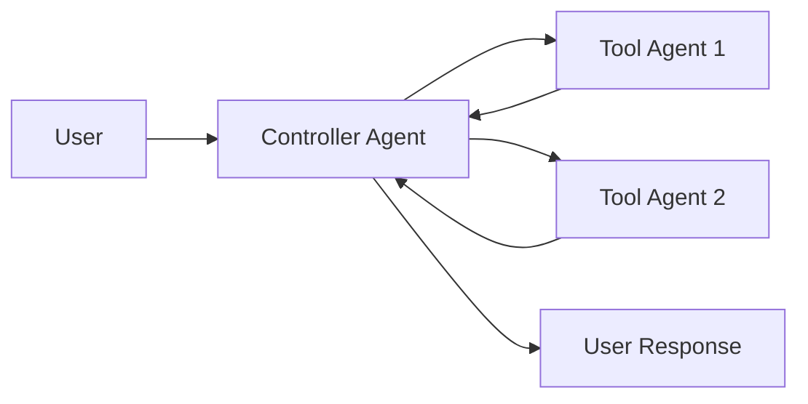
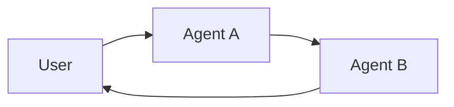

# 多代理

**多代理系统**将复杂的应用程序分解为多个专门化的代理，这些代理协同工作以解决问题。
与其依赖单个代理来处理每个步骤，**多代理架构**允许您将更小的、专注的代理组合成一个协调的工作流。

多代理系统在以下情况时很有用：

* 单个代理拥有太多工具，在使用哪个工具方面做出糟糕的决策。
* 上下文或记忆增长过大，单个代理无法有效跟踪。
* 任务需要**专业化**（例如，规划师、研究员、数学专家）。

## 多代理模式

| 模式                           | 工作原理                                                                                                                                                     | 控制流程                                               | 示例用例                                 |
| ----------------------------- | ---------------------------------------------------------------------------------------------------------------------------------------------------------------- | ---------------------------------------------------------- | ------------------------------------------------ |
| [**工具调用**](#工具调用)     | 一个**控制器**代理将其他代理作为*工具*调用。工具代理不直接与用户交互，只是运行任务并返回结果。           | 集中式：所有路由都通过调用代理传递。 | 任务编排、结构化工作流。        |
| [**交接**](#交接)             | 当前代理决定将控制权**转移**给另一个代理。活动代理发生变化，用户可能会继续与新代理直接交互。 | 分散式：代理可以改变谁是活动代理。            | 多领域对话、专家接管。 |

- **教程：构建主管代理**:
  学习如何使用主管模式构建个人助手，其中中央主管代理协调专门的工作代理。
  本教程演示：

  * 为不同领域创建专门的子代理（日历和邮件）
  * 将子代理包装为工具进行集中编排
  * 为敏感操作添加人在回路审查

## 选择模式

| 问题 | 工具调用 | 交接 |
| ----------------------------------------------------- | ------------ | -------- |
| 需要对工作流进行集中控制？ | ✅ 是 | ❌ 否 |
| 希望代理直接与用户交互？ | ❌ 否 | ✅ 是 |
| 专家之间复杂的、类似人类的对话？ | ❌ 有限 | ✅ 强 |

  您可以混合两种模式——使用**交接**进行代理切换，并让每个代理**将子代理作为工具调用**来执行专门任务。

## 自定义代理上下文

多代理设计的核心是**上下文工程**——决定每个代理看到什么信息。LangChain为您提供对以下方面的精细控制：

* 对话或状态的哪些部分传递给每个代理。
* 为子代理定制的专门提示词。
* 中间推理的包含/排除。
* 每个代理的自定义输入/输出格式。

您的系统质量**严重依赖**于上下文工程。目标是确保每个代理都能访问执行任务所需的正确数据，无论它是作为工具还是作为活动代理。

## 工具调用

在**工具调用**中，一个代理（"**控制器**"）将其他代理作为*工具*在需要时调用。控制器管理编排，而工具代理执行特定任务并返回结果。

流程：

1. **控制器**接收输入并决定调用哪个工具（子代理）。
2. **工具代理**根据控制器的指令运行其任务。
3. **工具代理**将结果返回给控制器。
4. **控制器**决定下一步或完成。



  用作工具的代理通常**不期望**继续与用户对话。
  它们的角色是执行任务并将结果返回给控制器代理。
  如果您需要子代理能够与用户对话，请使用**交接**。

### 实现

下面是一个最小示例，其中主代理通过工具定义获得对单个子代理的访问权限：

```python
from langchain.tools import tool
from langchain.agents import create_agent

subagent1 = create_agent(model="...", tools=[...])

@tool(
    "subagent1_name",
    description="subagent1_description"
)
def call_subagent1(query: str):
    result = subagent1.invoke({
        "messages": [{"role": "user", "content": query}]
    })
    return result["messages"][-1].content

agent = create_agent(model="...", tools=[call_subagent1])
```

在此模式中：

1. 主代理在决定任务与子代理的描述匹配时调用`call_subagent1`。
2. 子代理独立运行并返回其结果。
3. 主代理接收结果并继续编排。

### 在哪里自定义

有几个点可以控制上下文如何在主代理和其子代理之间传递：

1. **子代理名称**（`"subagent1_name"`）：这是主代理引用子代理的方式。由于它影响提示词，请仔细选择。
2. **子代理描述**（`"subagent1_description"`）：这是主代理“知道”的关于子代理的信息。它直接影响主代理决定何时调用它的方式。
3. **子代理的输入**：您可以自定义此输入以更好地塑造子代理解释任务的方式。在上面的示例中，我们直接传递代理生成的`query`。
4. **子代理的输出**：这是传递回主代理的**响应**。您可以调整返回的内容以控制主代理解释结果的方式。在上面的示例中，我们返回最终消息文本，但您可以返回额外的状态或元数据。

### 控制子代理的输入

有两个主要杠杆来控制主代理传递给子代理的输入：

* **修改提示词**——调整主代理的提示词或工具元数据（即子代理的名称和描述），以更好地指导何时以及如何调用子代理。
* **上下文注入**——通过调整工具调用以从代理的状态中提取，添加在静态提示词中不切实际的输入（例如，完整的消息历史、先前的结果、任务元数据）。

```python
from langchain.agents import AgentState
from langchain.tools import tool, ToolRuntime

class CustomState(AgentState):
    example_state_key: str

@tool(
    "subagent1_name",
    description="subagent1_description"
)
def call_subagent1(query: str, runtime: ToolRuntime[None, CustomState]):
    # 应用任何必要的逻辑来转换消息以适应输入
    subagent_input = some_logic(query, runtime.state["messages"])
    result = subagent1.invoke({
        "messages": subagent_input,
        # 您还可以在此处传递其他状态键。
        # 确保在主代理和子代理的状态模式中都定义了这些键。
        "example_state_key": runtime.state["example_state_key"]
    })
    return result["messages"][-1].content
```

### 控制子代理的输出

塑造主代理从子代理接收内容的两种常见策略：

* **修改提示词**——优化子代理的提示词以指定应该返回什么。
  * 当输出不完整、过于冗长或缺少关键细节时很有用。
  * 一个常见的失败模式是子代理执行工具调用或推理但**不包含结果**在其最终消息中。提醒它控制器（和用户）只看到最终输出，所以所有相关信息必须包含在那里。
* **自定义输出格式**——在代码中调整或丰富子代理的响应，然后再交还给主代理。
  * 示例：除了最终文本外，将特定的状态键传递回主代理。
  * 这需要将结果包装在[`Command`](https://reference.langchain.com/python/langgraph/types/#langgraph.types.Command)（或等效结构）中，以便您可以将自定义状态与子代理的响应合并。

```python
from typing import Annotated
from langchain.agents import AgentState
from langchain.tools import InjectedToolCallId
from langgraph.types import Command

@tool(
    "subagent1_name",
    description="subagent1_description"
)
# 我们需要将`tool_call_id`传递给子代理，以便它可以使用它来响应工具调用结果
def call_subagent1(
    query: str,
    tool_call_id: Annotated[str, InjectedToolCallId],
# 您需要返回一个`Command`对象来包含除最终工具调用外的更多内容
) -> Command:
    result = subagent1.invoke({
        "messages": [{"role": "user", "content": query}]
    })
    return Command(update={
        # 这是我们传递回主代理的示例状态键
        "example_state_key": result["example_state_key"],
        "messages": [
            ToolMessage(
                content=result["messages"][-1].content,
                # 我们需要包含工具调用ID，以便它与正确的工具调用匹配
                tool_call_id=tool_call_id
            )
        ]
    })
```

## 交接

在**交接**中，代理可以直接将控制权传递给彼此。“活动”代理发生变化，用户与当前拥有控制权的任何代理交互。

流程：

1. **当前代理**决定需要另一个代理的帮助。
2. 它将控制权（和状态）传递给**下一个代理**。
3. **新代理**直接与用户交互，直到决定再次交接或完成。



### 实现（即将推出）

***

  [在GitHub上编辑此页面的源代码。](https://github.com/langchain-ai/docs/edit/main/src/oss/langchain/multi-agent.mdx)

  [通过MCP以编程方式连接这些文档](/use-these-docs)到Claude、VSCode等，以获得实时答案。


---

> 要在此文档中查找导航和其他页面，请在以下位置获取llms.txt文件：https://docs.langchain.com/llms.txt