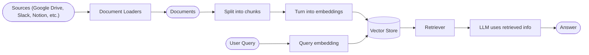
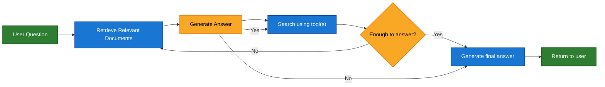

# 检索 (Retrieval)

大语言模型 (LLM) 功能强大，但它们有两个关键限制：

* **有限的上下文**——它们无法一次性摄入整个语料库。
* **静态的知识**——它们的训练数据在某个时间点被冻结。

检索通过在查询时获取相关的外部知识来解决这些问题。这是**检索增强生成 (RAG)** 的基础：用特定于上下文的信息增强 LLM 的答案。

## 构建知识库 (Building a knowledge base)

一个 **知识库** 是一个用于检索的文档或结构化数据的存储库。

如果您需要一个自定义的知识库，您可以使用 LangChain 的文档加载器和向量存储来从自己的数据中构建一个。

  如果您已经有知识库（例如，SQL 数据库、CRM 或内部文档系统），您**不**需要重建它。您可以：

  * 在代理式 RAG 中将其作为代理的**工具**连接。
  * 查询它并将检索到的内容作为上下文提供给 LLM [（2 步 RAG）](#2-step-rag)。

请查看以下教程来构建可搜索的知识库和最小 RAG 工作流：

- **教程：语义搜索**: 学习如何使用 LangChain 的文档加载器、嵌入和向量存储从自己的数据创建可搜索的知识库。在本教程中，您将在 PDF 上构建搜索引擎，启用与查询相关的段落检索。您还将在此引擎之上实现最小 RAG 工作流，以查看外部知识如何集成到 LLM 推理中。

### 从检索到 RAG (From retrieval to RAG)

检索允许 LLM 在运行时访问相关的上下文。但是，大多数实际应用会更进一步：它们**将检索与生成集成**，以产生有根据的、上下文感知的答案。

这是**检索增强生成 (RAG)** 背后的核心思想。检索管道成为结合搜索与生成的更广泛系统的基础。

### 检索管道 (Retrieval Pipeline)

典型的检索工作流如下所示：



每个组件都是模块化的：您可以交换加载器、分割器、嵌入或向量存储，而无需重写应用程序的逻辑。

### 构建模块 (Building Blocks)

  - **文档加载器**:
    从外部源（Google Drive、Slack、Notion 等）获取数据，返回标准化的[`Document`](https://reference.langchain.com/python/langchain_core/documents/#langchain_core.documents.base.Document)对象。
  
  - **文本分割器**:
    将大型文档分解为更小的块，这些块可以单独检索并适合模型的上下文窗口。
  
  - **嵌入模型**:
    嵌入模型将文本转换为数字向量，使得具有相似含义的文本在该向量空间中靠近。
  
  - **向量存储**:
    用于存储和搜索嵌入的专门数据库。
  
  - **检索器**:
    检索器是一个给定非结构化查询返回文档的接口。

## RAG 架构 (RAG Architectures)

RAG 可以通过多种方式实现，具体取决于您的系统需求。我们在下面的章节中概述每种类型。

| 架构 | 描述 | 控制 | 灵活性 | 延迟 | 示例用例 |
| --------------- | -------------------------------------------------------------------------- | --------- | ----------- | ---------- | ------------------------------------------------- |
| **2 步 RAG** | 检索总是在生成之前发生。简单且可预测 | ✅ 高 | ❌ 低 | ⚡ 快 | 常见问题、文档机器人 |
| **代理式 RAG** | 由 LLM 驱动的代理在推理过程中决定*何时*和*如何*检索 | ❌ 低 | ✅ 高 | ⏳ 可变 | 具有多个工具访问权限的研究助手 |
| **混合** | 结合两种方法的特征并带有验证步骤 | ⚖️ 中等 | ⚖️ 中等 | ⏳ 可变 | 具有质量验证的领域特定问答 |

  **延迟**: 延迟在 **2 步 RAG** 中通常更**可预测**，因为最大 LLM 调用次数是已知的并且被限制。这种可预测性假设 LLM 推理时间是主要因素。然而，实际延迟也可能受到检索步骤的性能影响，例如 API 响应时间、网络延迟或数据库查询，这些因素可能根据使用的工具和基础设施而有所不同。

### 2 步 RAG (2-step RAG)

在 **2 步 RAG** 中，检索步骤总是在生成步骤之前执行。这种架构直接明了且可预测，适用于许多应用程序，其中检索相关文档是生成答案的明确先决条件。


- **教程：检索增强生成 (RAG)**:
  了解如何使用检索增强生成构建能够基于您的数据回答有根据问题的问答聊天机器人。
  本教程介绍两种方法：

  * 使用灵活工具运行搜索的**RAG 代理**——适用于通用用途。
  * 每个查询只需要一次 LLM 调用的**2 步 RAG** 链——对于简单任务快速高效。

- **教程：检索增强生成 (RAG)**:
  了解如何使用检索增强生成构建能够基于您的数据回答有根据问题的问答聊天机器人。
  本教程介绍两种方法：

  * 使用灵活工具运行搜索的**RAG 代理**——适用于通用用途。


```python
import requests
from langchain.tools import tool
from langchain.chat_models import init_chat_model
from langchain.agents import create_agent


@tool
def fetch_url(url: str) -> str:
    """Fetch text content from a URL"""
    response = requests.get(url, timeout=10.0)
    response.raise_for_status()
    return response.text

system_prompt = """\
Use fetch_url when you need to fetch information from a web-page; quote relevant snippets.
"""

agent = create_agent(
    model="claude-sonnet-4-5-20250929",
    tools=[fetch_url], # A tool for retrieval [!code highlight]
    system_prompt=system_prompt,
    name="Agentic RAG",
)
```

**Extended example: Agentic RAG for LangGraph's llms.txt**:
  本示例实现了一个 **代理式 RAG 系统**，用于帮助用户查询 LangGraph 文档。代理首先加载 [llms.txt](https://llmstxt.org/)，其中列出了可用文档 URL，然后可以动态使用 `fetch_documentation` 工具根据用户的问题检索和处理相关内容。

  ```python
import requests
  from langchain.agents import create_agent
  from langchain.messages import HumanMessage
  from langchain.tools import tool
  from markdownify import markdownify


  ALLOWED_DOMAINS = ["https://langchain-ai.github.io/"]
  LLMS_TXT = 'https://langchain-ai.github.io/langgraph/llms.txt'


  @tool
  def fetch_documentation(url: str) -> str:  # [!code highlight]
      """Fetch and convert documentation from a URL"""
      if not any(url.startswith(domain) for domain in ALLOWED_DOMAINS):
          return (
              "Error: URL not allowed. "
              f"Must start with one of: {', '.join(ALLOWED_DOMAINS)}"
          )
      response = requests.get(url, timeout=10.0)
      response.raise_for_status()
      return markdownify(response.text)


  # We will fetch the content of llms.txt, so this can
  # be done ahead of time without requiring an LLM request.
  llms_txt_content = requests.get(LLMS_TXT).text

  # System prompt for the agent
  system_prompt = f"""
  You are an expert Python developer and technical assistant.
  Your primary role is to help users with questions about LangGraph and related tools.

  Instructions:

  1. If a user asks a question you're unsure about — or one that likely involves API usage,
     behavior, or configuration — you MUST use the `fetch_documentation` tool to consult the relevant docs.
  2. When citing documentation, summarize clearly and include relevant context from the content.
  3. Do not use any URLs outside of the allowed domain.
  4. If a documentation fetch fails, tell the user and proceed with your best expert understanding.

  You can access official documentation from the following approved sources:

  {llms_txt_content}

  You MUST consult the documentation to get up to date documentation
  before answering a user's question about LangGraph.

  Your answers should be clear, concise, and technically accurate.
  """

  tools = [fetch_documentation]

  model = init_chat_model("claude-sonnet-4-0", max_tokens=32_000)

  agent = create_agent(
      model=model,
      tools=tools,  # [!code highlight]
      system_prompt=system_prompt,  # [!code highlight]
      name="Agentic RAG",
  )

  response = agent.invoke({
      'messages': [
          HumanMessage(content=(
              "Write a short example of a langgraph agent using the "
              "prebuilt create react agent. the agent should be able "
              "to look up stock pricing information."
          ))
      ]
  })

  print(response['messages'][-1].content)

- **教程：检索增强生成 (RAG)**:
  了解如何使用检索增强生成构建能够基于您的数据回答有根据问题的问答聊天机器人。
  本教程介绍两种方法：

  * 使用灵活工具运行搜索的**RAG 代理**——适用于通用用途。
  * 每个查询只需要一次 LLM 调用的**2 步 RAG** 链——对于简单任务快速高效。

### 混合 RAG (Hybrid RAG)

混合 RAG 结合了 2 步 RAG 和代理式 RAG 的特征。它引入了中间步骤，如查询预处理、检索验证和生成后检查。这些系统比固定管道提供更多灵活性，同时保持对执行的一些控制。

典型组件包括：

* **查询增强**：修改输入问题以提高检索质量。这可能涉及重写不清晰的查询、生成多个变体或用额外上下文扩展查询。
* **检索验证**：评估检索的文档是否相关和充分。如果不相关，系统可以优化查询并再次检索。
* **答案验证**：检查生成答案的准确性、完整性和与源内容的一致性。如果需要，系统可以重新生成或修改答案。

该架构通常支持这些步骤之间的多次迭代：
```

```mermaid
graph LR
    A[User Question] --> B[Query Enhancement]
    B --> C[Retrieve Documents]
    C --> D{Sufficient Info?}
    D -- No --> E[Refine Query]
    E --> C
    D -- Yes --> F[Generate Answer]
    F --> G{Answer Quality OK?}
    G -- No --> H{Try Different Approach?}
    H -- Yes --> E
    H -- No --> I[Return Best Answer]
    G -- Yes --> I
    I --> J[Return to User]

    classDef startend fill:#2e7d32,stroke:#1b5e20,stroke-width:2px,color:#fff
    classDef decision fill:#f9a825,stroke:#f57f17,stroke-width:2px,color:#000
    classDef process fill:#1976d2,stroke:#0d47a1,stroke-width:1.5px,color:#fff

    class A,J startend
    class B,C,E,F,I process
    class D,G,H decision
  ```

该架构适用于：

* 具有模糊或不明确查询的应用程序
* 需要验证或质量控制步骤的系统
* 涉及多个源或迭代优化的工作流

- **教程：具有自我修正的代理式 RAG**:
  **混合 RAG** 的示例，结合了代理推理与检索和自我修正。

***

  [Edit the source of this page on GitHub.](https://github.com/langchain-ai/docs/edit/main/src/oss/langchain/retrieval.mdx)

  [Connect these docs programmatically](/use-these-docs) to Claude, VSCode, and more via MCP for real-time answers.


---

> To find navigation and other pages in this documentation, fetch the llms.txt file at: https://docs.langchain.com/llms.txt